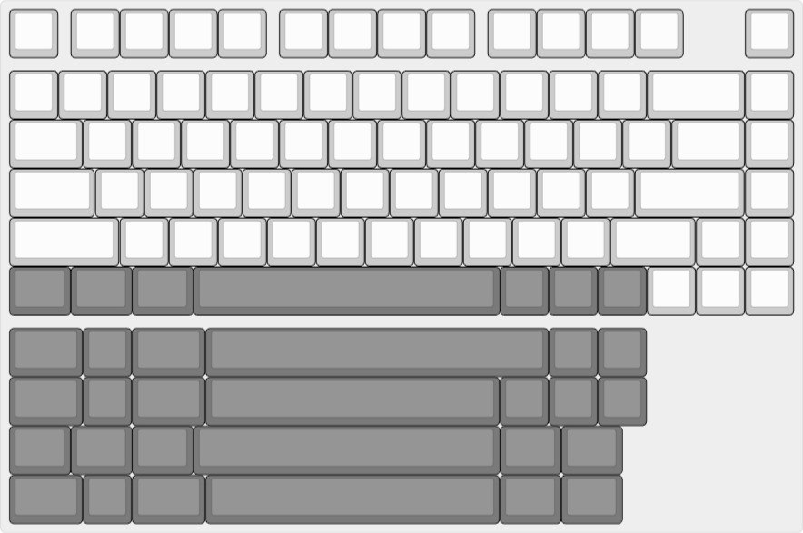

# Physalis

The Physalis is 75% Keyboard.  

## Part List

PCB --- 1 pcs  
RP2040 Zero --- 1 pcs  
Diode [1N4148 SMD] --- 82 pcs  
Hotswap Socket --- 82 pcs  
Switch --- 82/81 pcs  
2u Stabilizer --- 3 pcs  
6.25u or 7u or 6u Stabilizer --- 1 pcs 
